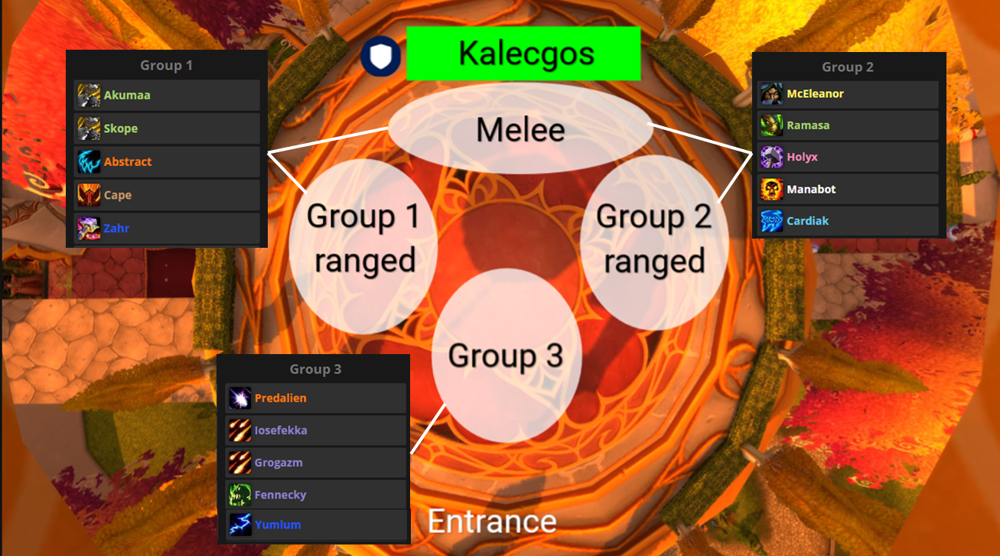
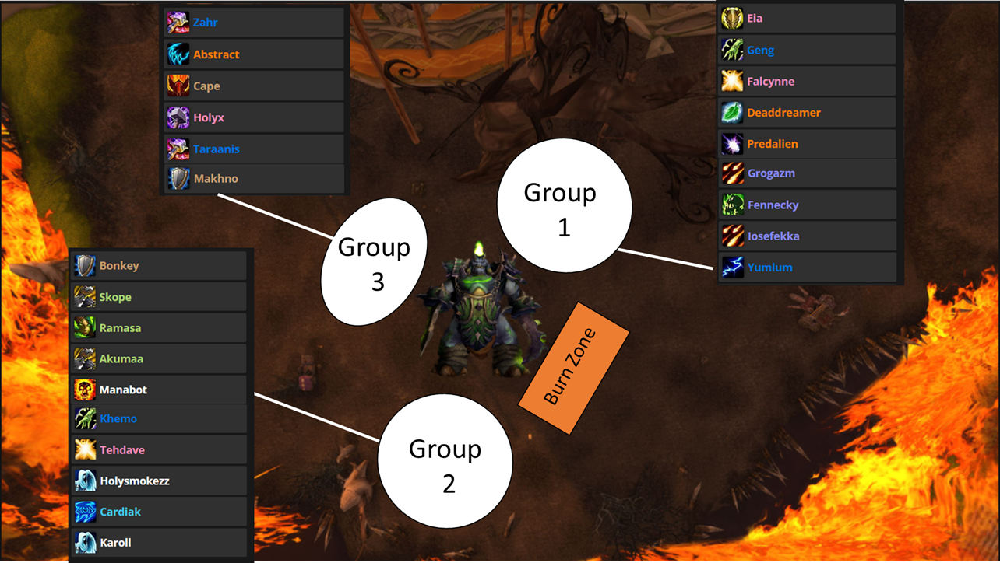

# Sunwell Plateau

- [Sunwell Plateau](#sunwell-plateau)
  - [Overview](#overview)
  - [Bosses](#bosses)
    - [Kelecgos/Sarthrovarr](#kelecgossarthrovarr)
      - [Guides](#guides)
    - [Brutallus](#brutallus)
    - [Felmyst](#felmyst)
    - [Eredar Twins](#eredar-twins)
    - [Muru](#muru)
    - [Kil'jaeden](#kiljaeden)
  - [Gearing](#gearing)
  - [Attunement](#attunement)

## Overview

Its a place and has some things

## Bosses

### Kelecgos/Sarthrovarr

Kalecgos is the first boss of the Sunwell Plateau raid, the final raid of The Burning Crusade Classic. While fighting Kalecgos, your raid will also have to contend with Sathrovarr the Corruptor who is dominating the mind of the dragon.

- Fight is split between 2 "realms", "normal" and "spectral"
- Both bosses need to be killed at the same time
- Bosses will enrage when either hits 10% health
- Kalecgos will spawn a portal to the "spectral" realm every 10 seconds and deal aoe damage
  - stay `/range 10` from others
- Kalecgos will cause a stacking debuff on the raid that can be cleared by bubble mechanics or going to the "spectral" realm via portals that spawn
  - @Tanks and @Healers need to split evenly between realms
  - @DPS should go to the "spectral" realm as often as possible
- When in "spectral" realm, everyone except the tank needs to stack behind boss
- Decurse debuff after 15 seconds
- Avoid head/tail of Kalecgos

#### Guides

- [30 Second Video Guide](https://www.youtube.com/watch?v=gWGVy5icl1E)
- [Wowhead - Written](https://tbc.wowhead.com/guides/kalecgos-sunwell-plateau-swp-strategy-burning-crusade-classic)

### Brutallus

Brutallus is the second boss of the Sunwell Plateau raid, the final raid of The Burning Crusade Classic. As his name suggests, Brutallus is a brutal boss. He will deal massive damage to your raid and has an enrage that will wipe the raid if they are not quick enough to kill him. Damage dealers, tanks, and healers will all need to perform at their maximum to take this boss down.

- 5 minute enrage
- All raiders stay `range 5` from one another
- Tanks to swap aggro every 3 meteor strikes

  
Reference Guides

- [30 Second Video Guide](https://www.youtube.com/watch?v=-z8WEk7cIpc)
- [Wowhead - Written](https://tbc.wowhead.com/guides/kalecgos-sunwell-plateau-swp-strategy-burning-crusade-classic)

### Felmyst

### Eredar Twins

### Muru

### Kil'jaeden

## Gearing

- All raiders will need at least 120 Arcane Resist for some fights
- Tanks will need both threat and mitigation sets
- DPS will need gear to support extended fights

## Attunement

None